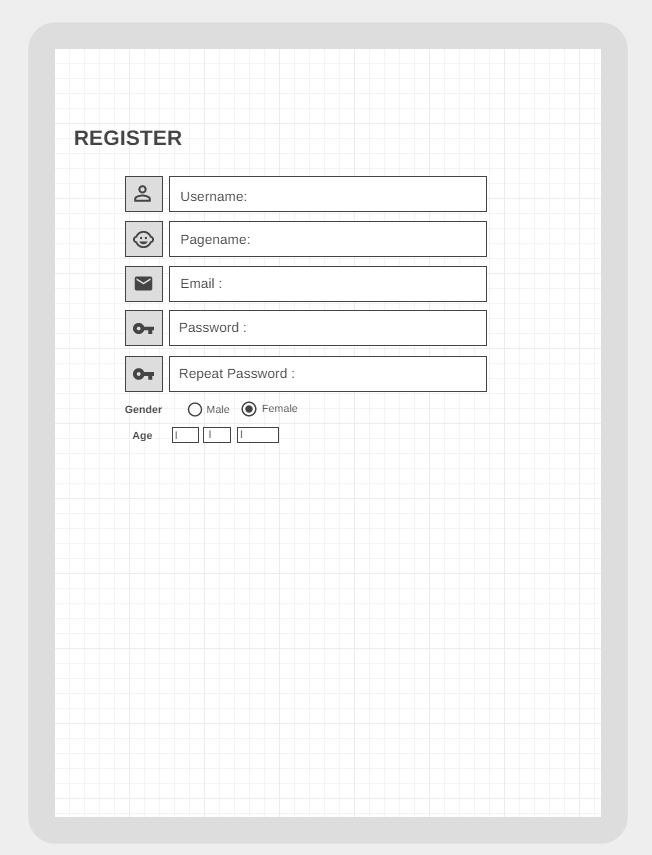

# TITANS-FRONTEND

## Intro:
This project repository for a website called Flouvers 101 which contains a variety categories of food recipes which provide you with a short description for each recipe, and you can interact with it, either favorites or share your feedback. 

## Group Members : 👥
- Abdallah Alabed.
- Abdullah Alabbadi.
- Ayyoub Al Keyyam.
- Ibrahim Alhamshari.
- Latifa Amaireh.
- Sanabel Abu Ezbead.
-------------------------------------------------------------------------------------------------------------------
## Problem Domain:
There is some difficulty in choosing what you want to eat or cook, especially for mothers 
To make it more interesting ,less confusing we build our website to introduce a lot of delicious recipes .
## Wireframe:

## How to build our websites :

## recourses

**https://unsplash.com/**
**https://colorhunt.co/**
**https://fonts.google.com/**
**https://developer.mozilla.org/en-US/**
**https://dashboard.visme.co/v2/projects/own**

## 1- Flavours 101!

**1- summary of the idea.** :pushpin:

  
**2- What problem or pain point does it solve?** :pushpin:

It guides people to different types of food recipes.

---------------------------------------------------------------------------------------------------------------------
# Domain Modeling : 

https://docs.google.com/document/d/1Ttg4U8wUuYklIU0iK4aq9cR7tyAWd6D9htSQmsacbr0/edit?usp=sharing

---------------------------------------------------------------------------------------------------------------------
# Wireframes :

https://docs.google.com/document/d/1h8Horimj6TpCoRULUnORSjZVth_MTfcQ361XI7KBaUA/edit?usp=sharing

---------------------------------------------------------------------------------------------------------------------
# USER STORIES : 
- As a user, I want a page where I can find all my-targeted-recipies.
- As a user, I want to save certain recipies. 
- As a user, I want to interact with other recipies. 
- As a user, I want to share my own recipies with others. 
- As a user, I want to be able to follow other people. 

