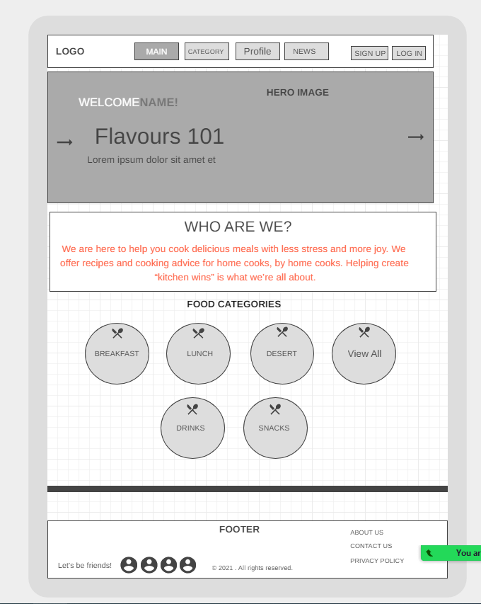
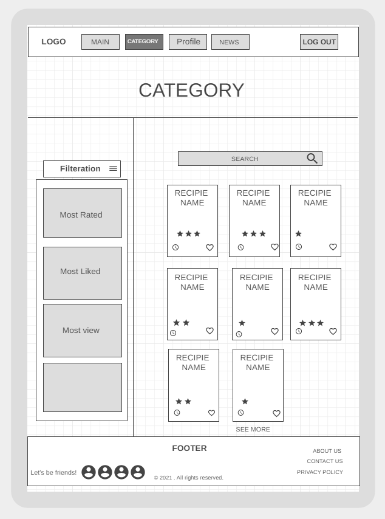
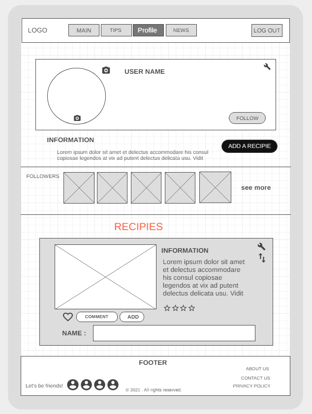
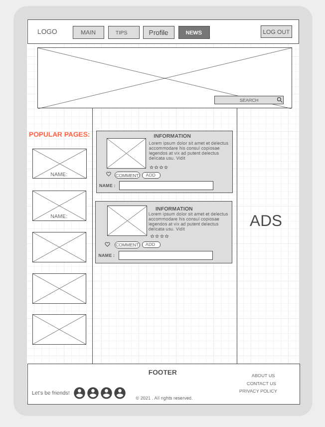
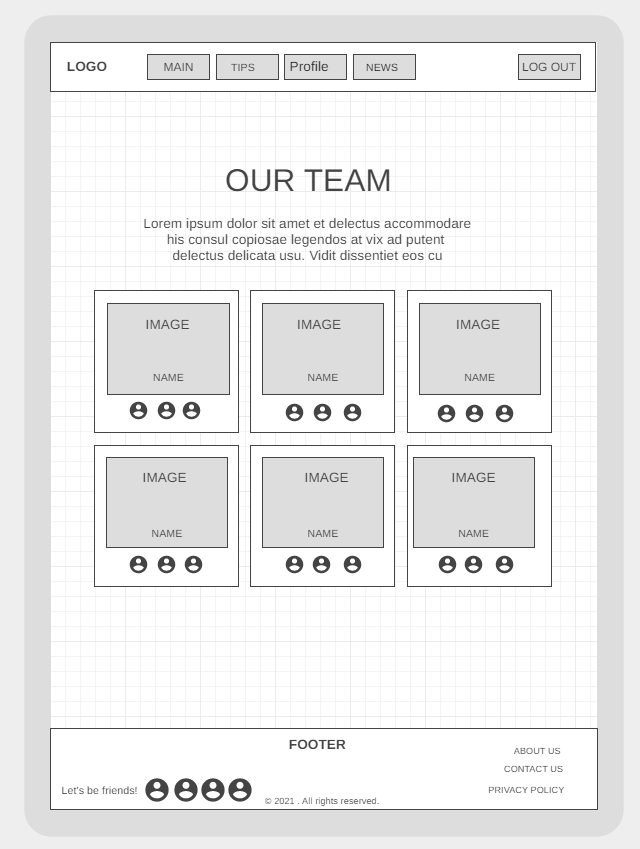
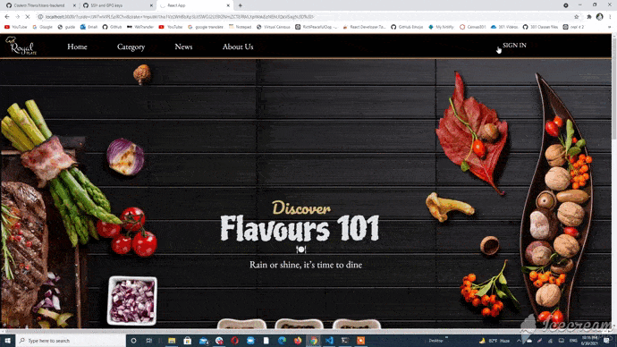
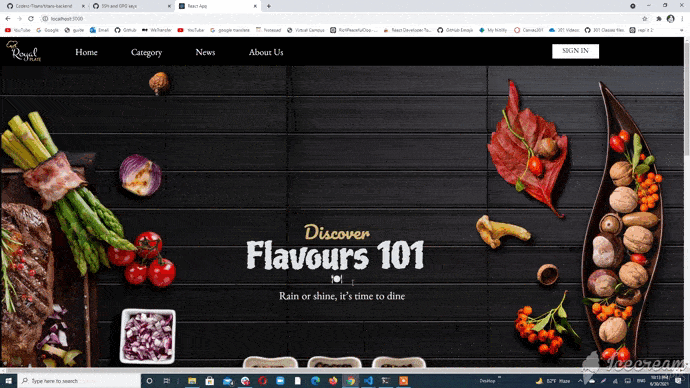
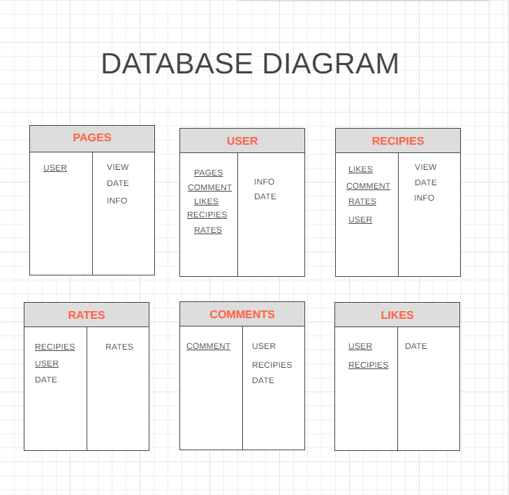

# TITANS-FRONTEND

## Intro:
This project repository for a website called Flouvers 101 which contains a variety categories of food recipes which provide you with a short description for each recipe, and you can interact with it, either favorites or share your feedback. 

## Group Members : 👥
- Abdallah Alabed.
- Abdullah Alabbadi.
- Ayyoub Al Keyyam.
- Ibrahim Alhamshari.
- Latifa Amaireh.
- Sanabel Abu Ezbead.
-------------------------------------------------------------------------------------------------------------------
## Problem Domain: :pushpin:
There is some difficulty in choosing what you want to eat or cook, especially for mothers 
To make it more interesting ,less confusing we build our website to introduce a lot of delicious recipes .

## Wireframe:

## How to use our websites :
+ In homepage we provide a links to all pages and the user can choose also from multiple categorites of foods, each category consists of different types of recipies.

  
+ The user can log in by using auth0 and there will be a profile page for him.  

+ In category page, the user can search for his favourtite food and the result will show to him different ways to cook his specific food. Also there's a dropdown button which unable him to choose to see the most favourite foods provided with other options.    

  
+ This page won't generated if the user didn't log in. In this page the user can change his profile picture or cover, and he can also add his own recipies to the page or edit them and anyone can comment on them.  

  
+ In about us, the user will meet the people who worked on this project with their contact informations.  

  
## Recourses
1- [UNSPLASH](https://unsplash.com/)

2- [COLORHUNT](https://colorhunt.co/)

3- [FONT GOOGLE](https://fonts.google.com/)

4- [DEVELOPR MOZILLA](https://developer.mozilla.org/en-US/)

5- [DASHBOARD VISME](https://dashboard.visme.co/v2/projects/own)

**1- summary of the idea.** :pushpin:
- A website that contains a variety categories of food recipes which provide you with a short description for each recipe, and you can interact with it, either favorites or share your feedback.

**2- What problem or pain point does it solve?** :pushpin:
- It guides people to different types of food recipes.

---------------------------------------------------------------------------------------------------------------------
# Domain Modeling : 

---------------------------------------------------------------------------------------------------------------------

---------------------------------------------------------------------------------------------------------------------
# USER STORIES : 
- As a user, I want a page where I can find all my-targeted-recipies.
- As a user, I want to save certain recipies. 
- As a user, I want to interact with other recipies. 
- As a user, I want to share my own recipies with others. 
- As a user, I want to be able to follow other people. 

